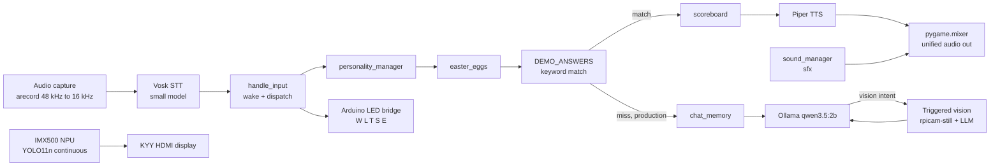

# Architecture

This document describes how Echo IRIS is built as a software system. It
covers the two hardware targets, the module layout, how a single voice
interaction flows through the code, and the design decisions behind the
choices that shape the runtime. It is written for future ECE 202 teams
who will inherit and extend this codebase, with secondary value for open
source forkers and the CSU department.

## Two builds, one repository

The repository ships two distinct entry points that share helper
modules. The split exists because demo day required a guaranteed
crash-proof fallback path that the 16GB production build could not
provide on its own.

`echo_iris_8gb.py` is the demo-mode build. `DEMO_MODE = True` is set as
a module constant. No LLM runs at runtime. Every user query routes to a
keyword-indexed dictionary called `DEMO_ANSWERS` or to one of the
fallback redirect phrases. The build is intentionally simple and was
built to run on the original 8GB Pi 5 with the small Vosk model and
Piper TTS as the only AI dependencies. It exists because Ollama plus
Vosk plus Piper plus a 2B-parameter model exceeded 8GB of RAM under
load.

`echo_iris_16gb.py` is the production build. It loads the full
multi-module architecture: personality switching, scoreboard tracking,
easter eggs, persistent chat memory, the optional RAG module (disabled
at runtime by default in v1.0.0), the IMX500-backed triggered-vision
path, and the Arduino LED bridge. It was built for a 16GB Pi 5 that
shipped via the department mid-semester and ran the demo as the primary
path.

A single conversation interaction looks the same from the outside on
either build. Wake word, then a question, then a response. The
difference lives entirely behind `handle_input`. Future teams should
default to extending the 16GB build and only touch the 8GB build when a
guaranteed-no-LLM safety path is needed.

## System overview

The diagram above shows two parallel paths through the camera. YOLO11n
runs continuously on the IMX500 on-camera neural processor at zero Pi
CPU cost and renders bounding boxes to the HDMI display through the
Picamera2 preview pipeline. The triggered-vision path through `rpicam-
still` only fires when the dispatch chain detects a vision-intent query,
captures one still, and passes it as a base64 image to qwen3.5:2b for
scene description. These are independent. The continuous YOLO path
keeps running while the LLM is waiting on a vision response.

## Module walkthrough

The 16GB entry script imports helpers in the order below. Each module
owns one concern. The pattern is deliberate. A future team can read any
single file and understand its scope without holding the whole script in
working memory.

### sound_manager.py

Owns sound effect playback. Wraps `pygame.mixer.Sound` with a small
state machine that decides whether a given moment in the dispatch chain
should play a sound, and which one. The module is the reason the SDL
audio backend environment variables must be set before `import pygame`
in the main script. Misordering that import is a known v3.4 bug that
v1.0 ships fixed.

The module also gates two sound-effect categories that v3.4 disabled.
Tick-tock and muscle-car effects were tied to a "thinking duration"
threshold and triggered too often during the LLM-disabled DEMO_ANSWERS
path. The thresholds are pinned high enough in v1.0 that the effects
effectively never fire. Future teams who want them back should lower
the thresholds rather than re-add the call sites.

### scoreboard.py

Tracks two counters and exposes them on demand. The first counter is
demo-day conversation count. The second is wake-word event count. The
module is the answer to the demo question "how many people have you
talked to today" and the audience reaction to that answer was strong
enough to keep it as a permanent feature.

### personality_manager.py

Owns the four personalities defined in `personalities.json`: default,
pirate, robot, surfer. The module exposes `check_switch` which scans
recognized text for a switch trigger and returns the new personality
name. The 16GB script calls this near the top of the dispatch chain so
a personality switch does not first hit the DEMO_ANSWERS or LLM paths.

The module also handles a Vosk mishearing trap. The wireless K1 mic in
the demo room frequently hears "pirate" as "parrot." The module accepts
both as triggers for the pirate personality. Treat this as a pattern.
Future personalities should be tested against Vosk in the actual demo
environment before their trigger words are finalized.

### chat_memory.py

Persists conversation history to a JSON file on disk and reloads it on
script start. Memory is bounded by `MAX_HISTORY` and trimmed FIFO. The
module is only consulted on the 16GB build and only on the LLM path. The
DEMO_ANSWERS path does not read or write memory because its responses
are stateless by design.

### easter_eggs.py

A small intercept layer that catches a handful of demo-day catchphrases
before the dispatch chain reaches DEMO_ANSWERS. The grade-question
intercept switches Piper to a different speaker ID for a comedic voice
break. The "nine plus ten" intercept catches the recognized variants
"nine plus ten" and the Vosk mishearing "nine posts ten" and answers
twenty-one. Both fired during the actual demo and got the intended
laughs.

### iris_detector.py

Wraps the `rpicam-still` subprocess for the triggered-vision path.
Captures one image to a known temp path, base64-encodes it, and returns
the encoded string for the LLM payload. The module is intentionally not
threaded. Concurrent captures crashed the IMX500 firmware in early
testing and required full power cycle to recover. Treat the
"one capture per LLM request" constraint as a hard rule.

This module does not own the YOLO11n bounding box pipeline. That runs
in the Picamera2 preview loop and is configured in the entry script
directly through Picamera2 callbacks. The two paths share the camera
hardware but never the firmware-level capture pipeline.

### iris_rag.py and iris_knowledge.md

A 26-chunk hand-curated knowledge base plus a runtime cosine-similarity
retriever. The retriever cache lives at `~/iris_rag_cache.json` and is
explicitly excluded from version control. The module ships in v1.0.0
but is not wired into the dispatch chain by default. DEMO_ANSWERS
covered the demo questions reliably and the RAM cost of running RAG
alongside the 2B LLM was not worth the gain. Future teams who want to
re-enable RAG should follow the import chain in the file header
comment.

### Arduino LED bridge sketch

A small Arduino C++ program that listens on the Nano R4's USB serial
interface for single-character state codes and updates discrete status
LEDs accordingly. The protocol is intentionally minimal:

- `W` waiting (idle)
- `L` listening (active mic)
- `T` thinking (dispatch chain working)
- `S` speaking (Piper output in flight)
- `E` error

The protocol survived the WS2812B-to-discrete-LEDs hardware change
without modification because it never depended on the LED count or
addressing scheme. Future teams who swap LED hardware again can keep
the protocol and only rewrite the Arduino sketch.

## Data flow: a single voice interaction

The trace below follows one wake-word-then-question interaction through
the 16GB build, end to end.

1. The K1 lavalier mic on USB card 3 streams 48 kHz 16-bit mono audio
   into an `arecord` subprocess pipe. PyAudio is not used. The decision
   reasoning is in the design section below.
2. Audio crosses a Kaldi LinearResample that converts 48 kHz to the
   16 kHz Vosk expects. The resample is in-process and does not buffer.
3. Vosk consumes the resampled stream chunk by chunk and emits partial
   and final transcripts. The script polls for finals.
4. The first wake-word check fires on every final transcript. Wake words
   include the misheard variants Vosk produces in the demo room.
5. On a wake-word match, the script transmits `b'L'` to the Arduino
   serial bridge and starts an active listen window with a silence
   timer.
6. The next final transcript becomes the dispatch input. The script
   transmits `b'T'`.
7. `handle_input` runs the dispatch chain in this order: personality
   switch check, easter egg check, DEMO_ANSWERS keyword match, LLM
   path. The first hit wins.
8. On a DEMO_ANSWERS hit, the matched entry returns its answer plus
   optional contextual acknowledgment. The scoreboard increments. The
   script transmits `b'S'`.
9. On a miss in production mode, the chat history appends, an Ollama
   payload is built with the system prompt and message history, and
   the request fires against `localhost:11434`. `think: False` is set
   at the top level of the payload to disable qwen3.5's reasoning chain.
   `num_thread: 2` caps Ollama at 2 of 4 CPU cores.
10. If the LLM returns a vision-intent response, the script invokes
    `iris_detector` for one still capture, base64-encodes the image,
    and re-sends a follow-up payload with the image attached. The
    response from this second call is the text spoken to the user.
11. The response text passes through a sanitization step that strips
    asterisks, hashes, and any non-ASCII characters that would crash
    Piper or the latin-1 Pi terminal.
12. The sanitized text streams to a Piper subprocess. Piper's raw PCM
    output is captured and handed to `pygame.mixer.Sound(buffer=...)`
    rather than piped to `aplay`. The reasoning is in the design
    section.
13. After playback completes, the script transmits `b'W'` and the loop
    returns to wake-word listening.

The sound_manager module operates orthogonally. It can play sound
effects at any state transition without disrupting the main flow because
pygame.mixer manages its own audio channels independently of the Piper
playback channel.

## Design decisions

Each decision below was an active choice made against an alternative
that was tried and discarded. Future teams should re-evaluate any of
these only after reading the failure mode that motivated the choice.

### arecord subprocess instead of PyAudio

The K1 wireless lavalier mic streamed clean audio when read by an
`arecord` subprocess and produced a word-doubling artifact when read by
PyAudio with the same sample rate and frame size. The artifact was not
reproducible on the wired mic the project started with. Switching to
`arecord` eliminated the issue without further investigation. The
subprocess approach also makes the audio source explicit at the
operating system level which simplifies debugging when card numbers
swap on reboot.

### pygame.mixer.Sound for Piper playback instead of aplay pipe

The 8GB build used a Piper-to-aplay subprocess pipe. The 16GB build
introduced `sound_manager` which holds an open `pygame.mixer` instance
for sound effects. Running both `aplay` and pygame.mixer concurrently
caused intermittent ALSA contention and the speaker would drop the
first half-second of one stream when the other started. Routing Piper
output through `pygame.mixer.Sound(buffer=raw_audio)` placed all audio
on the same backend and eliminated the contention.

### Pure cosine similarity over ChromaDB for RAG

The 26-chunk knowledge base is small enough that an in-memory cosine
similarity retriever finds the top-k chunks faster than ChromaDB's
client startup time. ChromaDB also imports heavy dependencies that
extend the cold-start time on the Pi. The custom retriever is roughly
80 lines of Python and depends only on `numpy`. For a knowledge base
under a few hundred chunks the trade is favorable.

### DEMO_ANSWERS dictionary as primary dispatch path

Demo questions cluster heavily around a few topics: who built it, what
it does, how it works, what the team's major is, what CSU is, what the
LLM is, what the camera is. A keyword-indexed dictionary covers more
than 90 percent of expected demo questions in low milliseconds and with
no LLM dependency. The LLM path is reserved for unstructured questions
that fall through. The order matters: the first keyword match wins, so
keyword conflicts must be resolved by ordering more specific categories
ahead of more general ones.

### Triggered-only LLM vision instead of continuous

Continuous frame-by-frame LLM vision was prototyped early and rejected.
A 2B-parameter vision model takes seconds per frame on a Pi 5. The
audience experience degrades sharply when the vision narration lags the
visual scene by 10 seconds. The triggered model only fires on
vision-intent queries, captures one still, and provides a single
response. The continuous YOLO11n path on the IMX500 NPU handles the
real-time visual feedback role with bounding boxes drawn at camera
frame rate.

### Discrete LEDs after WS2812B failure

The original LED architecture used a WS2812B addressable strip driven
by an Arduino Nano R4 over a serial bridge. The strip itself never
worked reliably enough for demo deployment. The Arduino bridge stayed.
The five-state W/L/T/S/E protocol stayed. The strip got swapped for
discrete status LEDs wired to GPIO pins on the Nano R4. Future teams
who want to revisit the strip should keep the serial protocol and
rewrite only the Arduino sketch.

### Direct Arduino PWM after PCA9685 failure

The Arducam B0283 pan/tilt bracket ships with a PCA9685 PWM driver
mounted on a UC-751 PCB. The PCA9685 was unresponsive on both the Pi 5
I2C bus and the Nano R4 I2C bus. Diagnosis was abandoned in favor of
direct PWM from Nano R4 pins D9 and D10 to the two servos. The
direct-PWM path works and is documented in the hardware setup guides.
The PCA9685 is left on the bracket as inert hardware.

### apt-mark hold for the camera stack

On the 16GB build, `libcamera`, `rpicam-apps`, `picamera2`, and the
firmware-tools-rpi package are pinned. A Pi OS update mid-development
broke the IMX500 firmware upload path until the affected packages were
rolled back. The 16GB setup guide documents the exact apt-mark hold
list that prevents a recurrence. The 8GB build does not need the hold
list because it does not use the IMX500 firmware upload path.

## Future work

The items below were considered for v1.0.0, scoped, and deferred. They
are listed here as engineering opportunities for future ECE 202 teams,
not as project failures. The demo ran. The repo is complete as
shipped.

A native Anthropic API integration would replace the local Ollama call
on the LLM path. The trade is response quality versus offline capability
and ongoing API cost. A future team could add it as a config flag.

A swap to a smaller text-only LLM such as `gemma3:1b` could improve
latency on the LLM path at the cost of response quality. The current
qwen3.5:2b chosen for vision capability already runs the text path and
swapping the text model alone is a non-trivial refactor.

An evdev-based hotkey bypass would let a presenter trigger fixed
demo answers from a remote without speaking. The dispatch chain already
exists in a callable form so the integration surface is small.

A streaming-cancel feature would let the speaker interrupt a Piper
response with the wake word. The current architecture buffers the
entire response before playback so cancellation requires a refactor of
the Piper subprocess handling.

The pirate personality voice is currently the default Piper speaker
with a personality prompt. A different Piper voice model with a more
distinct timbre would improve the personality-switch effect.

WS2812B integration could be revisited with a different strip or driver
combination. The serial protocol is reusable.

Re-enabling RAG at runtime is a one-line change in the dispatch chain
plus tuning of the `MIN_CONFIDENCE` threshold. The 26-chunk knowledge
base ships as-is and can be extended.

A split-screen Pygame UI was prototyped in mid-development that placed
the YOLO11n bounding box feed and the conversation log side by side on
the KYY monitor. The split-screen layout was deferred for demo day in
favor of the cleaner single-pane Picamera2 preview. A future team who
wants to surface the conversation log live could resurrect the
prototype.

48 kHz to 16 kHz audio downsampling for Vosk is settled in v1.0.0 and
is not future work. The Kaldi LinearResample in the audio path is
stable and measured.

## Document footnotes

The Ollama model name above is recorded as `qwen3.5:2b` per the v3.4
reconstructed source in the 16GBPipelineFixes synthesis. An earlier
v2 handoff specified `qwen3.5:2b-q4_K_M` with explicit quantization
suffix. The actual line in the deployed v3.4 source is the truth. The
ATTRIBUTIONS file flags this same point and a one-command verification
on the Pi resolves it for both files.
